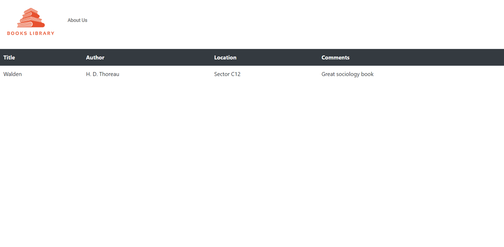

<h1 align="center">
    
</h1>

<h4 align="center"> 
Books Library
</h4>

<p align="center">
 
  

  
 
  

</p>


## About the Project

For library Users - Web platform where users can search by Title or Author available books on the library.On the search result the user will find some descritive comments about the books, as well as it's sector location on library.
For library Staff - The staff will be able to add new books, delete and edit any information for updating books database.
** The staff access page is being developed.

###### This project is being developed for learning and improving my skills. I plan on add some features as I learn more development tools.


## 🎨 Layout

### Web

<p align="center" style="display: flex; align-items: flex-start; justify-content:space-evenly;">
  
  
</p>

## 🛠 Dev Technologies

- Node.js
  - Express
  - Sqlite
  - EJS
- JavaScript
- HTML
- CSS

### Requirements

The basic tools needed to run this application are [Node.js][nodejs], [Git](https://git-scm.com) and a code editor, I choose to use [VSCode][vscode]

### Running the aplicattion (Front End)

```bash
# Clone this repsitory
$ git clone https://github.com/ogab81/library

# Acess the projects folder on terminal/cmd
$ cd library

# Install all dependencies
$ npm install

# execute the application on developer mode
$ npm run start

# Application will be running on port:3000 -  http://localhost:3000
```


## Make more of this project

1. **fork** the project
2. Create a new branch with your features : `git checkout -b my-feature`
3. Commit your changes: `git commit -m "feature: My new feature"`
4. Push to the branch: `git push origin my-feature`
> Some more on contributing on projects [How to contribute on GitHub guide](https://github.com/firstcontributions/first-contributions)


## 📝 Licença
Under MIT license.
##### By Gabe Portela 👋🏽 [Contact!](https://www.linkedin.com/in/gabriel-portela-788a25170/)

[nodejs]: https://nodejs.org/
[vscode]: https://code.visualstudio.com/
[vceditconfig]: https://marketplace.visualstudio.com/items?itemName=EditorConfig.EditorConfig
[license]: https://opensource.org/licenses/MIT
[vceslint]: https://marketplace.visualstudio.com/items?itemName=dbaeumer.vscode-eslint
[prettier]: https://marketplace.visualstudio.com/items?itemName=esbenp.prettier-vscode
